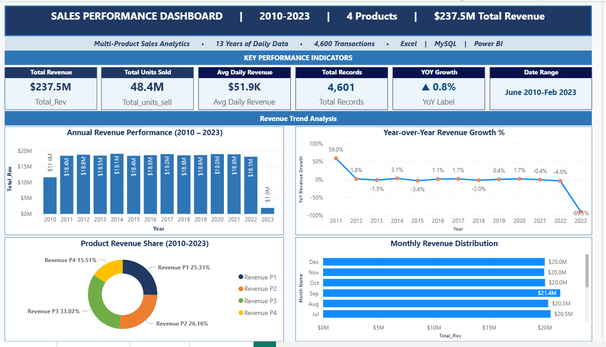

# Sales Analytics Dashboard
Excel · MySQL · Power BI · End-to-End Business Intelligence Project

##  30-Second Summary

Analyzed 4,600 daily transactions across 4 products over 13 years (2010–2023), uncovering $237.5M in total revenue through an end-to-end analytics pipeline — from raw data preparation to executive dashboarding.

📦 Dataset-4,600 rows · 4 products · Jun 2010 – Feb 2023
💰Revenue Analyzed-$237.5 million total · $48.4M units sold
🛠️ ToolsExcel- · MySQL 8.0 · Power BI · DAX
📄 Deliverables- Excel Workbook · 24 SQL Queries · 4-Page BI Dashboard

---

## Tools Used

- Excel
- MySQL
- Power BI
- DAX
- Pivot Tables

---

## 🏆 Key Business Findings
1. Subscription-Model Behavior
Annual revenue held within a $18–19M range for 10 consecutive years with sub-4% variance — consistent with contract-driven demand rather than discretionary purchasing.
2. Portfolio Equilibrium
All 4 products maintained ~25% revenue share each across 13 years — a structurally balanced portfolio that also signals an untapped mix-optimization opportunity.
3. September is a Structural Peak
September delivers the highest monthly revenue ($21.4M lifetime) every single year — validated across the full time series, not a one-off spike. February's apparent weakness is a 28-day calendar artifact, not a demand signal.
4. Pandemic Resilience
2020 revenue grew +1.7% YoY during a period of broad market contraction — demonstrating demand inelasticity that distinguishes this business from discretionary consumer sectors.

---

## 🛠️ Phase Breakdown
## Phase 1 — Excel

Cleaned and structured 4,600 rows with professional formatting
Built 6 calculated columns using INDEX-MATCH, SUMIF, nested IF, IFERROR, and TEXT functions
Created 5 Pivot Tables with interconnected slicers
Designed an Executive Dashboard with KPI cards, 6 charts, and a business insights panel

## Phase 2 — MySQL

Designed a normalized schema with 2 tables and 6 performance indexes
Wrote 24 analytical queries across two complexity tiers
Advanced concepts: Window Functions (LAG, RANK, NTILE), CTEs, Self JOINs, Correlated Subqueries, ROLLUP, Stored Procedures, and Views

## Phase 3 — Power BI

Built a Date Table (5,114 dates) with time intelligence relationships
Created 18 DAX measures including YoY growth, SAMEPERIODLASTYEAR, AVERAGEX, and directional arrow labels
Delivered a 4-page interactive dashboard with cross-filtering slicers and a monthly heatmap matrix

---

## 📊 Dashboard Pages
## Page                            Purpose
Executive Overview              KPI cards, annual trend, YoY growth, product share
Product Analysis                Revenue & units by product, donut charts, comparison bars
Time Trends                     Monthly heatmap, quarterly stacked, 13-year trend line
Data Explorer                   Slicers (Year · Quarter · Category) + dynamic transaction table
 
---

## Key Insights

- Product-level revenue contribution varied significantly across years.
- Revenue trends highlighted seasonal demand fluctuations.
- Certain years showed declining growth despite stable transaction volume.
- KPI analysis improved visibility into operational performance trends.

---

## Project Structure

```text
sales-analytics-dashboard/
│
├── data/
├── sql/
├── powerbi/
├── screenshots/
├── insights/
├── README.md
├── LICENSE
└── .gitignore
```

---

## Dashboard Preview

### Dashboard Overview



---

## Author

Kashish Kedia

LinkedIn: https://linkedin.com/in/kashish-kedia
